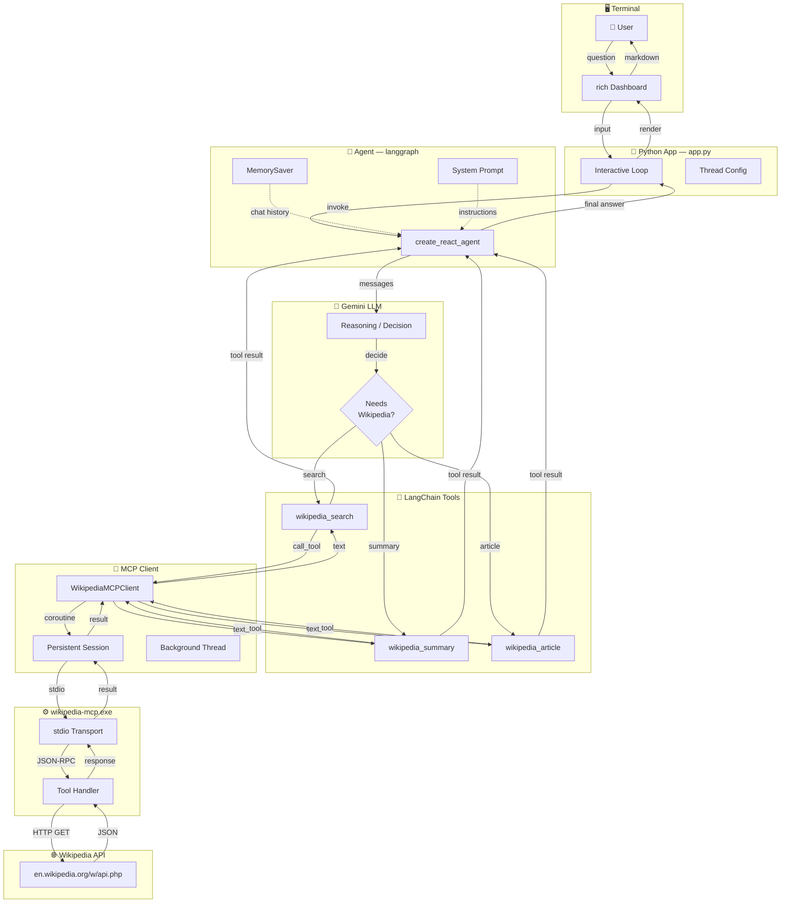
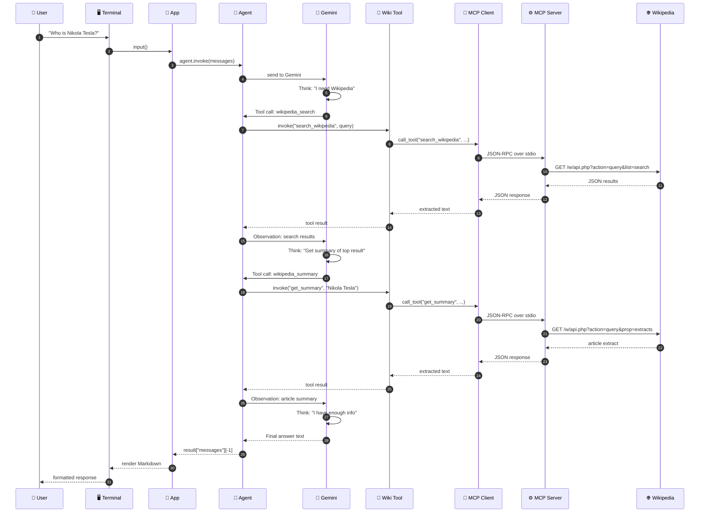
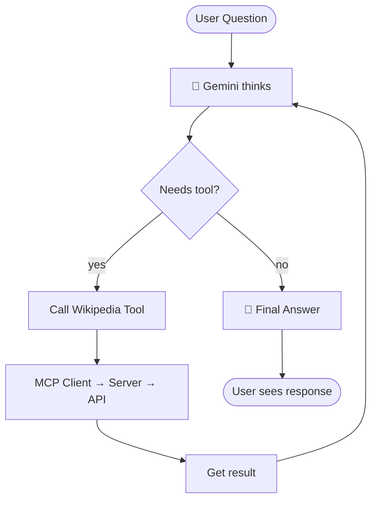
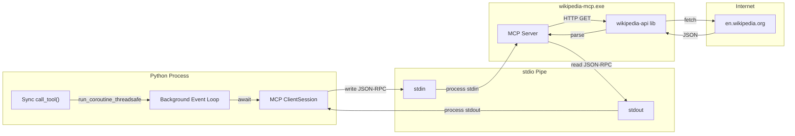

# WikiResearch AI — Architecture

## High-Level Architecture



## Request Flow — Single Question



## Agent Decision Loop (ReAct Pattern)



## MCP Communication Layer



## File Structure

```
wiki-agent/
├── app.py                      # Terminal dashboard + interactive loop
├── config.py                   # API keys, model config
├── requirements.txt
├── architecture.md             # This file
│
├── agent/
│   ├── __init__.py
│   ├── agent.py                # create_react_agent setup
│   ├── llm.py                  # Gemini LLM instance
│   ├── memory.py               # MemorySaver for conversation
│   └── tools.py                # LangChain tools wrapping MCP
│
├── mcp_client/
│   ├── __init__.py
│   └── client.py               # Persistent MCP client (1 subprocess)
│
├── prompts/
│   └── system_prompt.py        # WikiResearch AI instructions
│
└── utils/
    └── console.py
```
